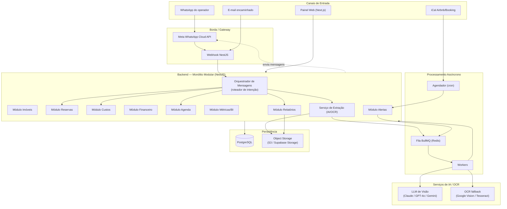
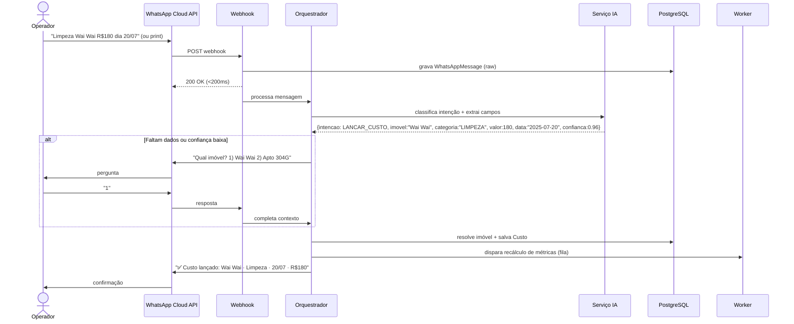
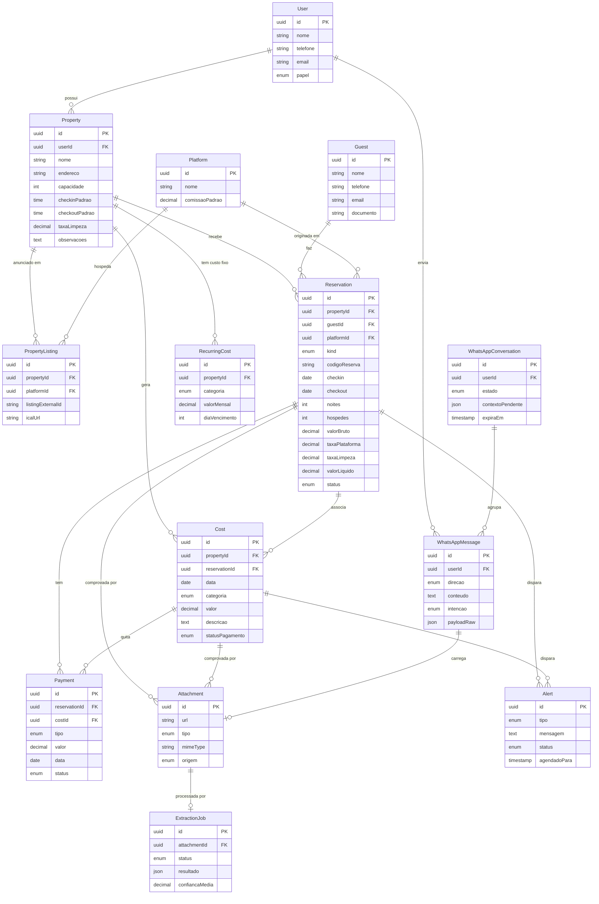

# Sistema de Gestão de Locação por Temporada (PMS Simplificado)

> Documento de arquitetura — versão 1.0
> Stack: Next.js + NestJS + PostgreSQL + Prisma + WhatsApp Cloud API + IA (visão/texto)

---

## 0. Resumo executivo e decisões de arquitetura

Antes do detalhamento, três decisões definem todo o projeto. Elas existem porque o escopo original tem premissas que, na prática, não funcionam como descrito — e é melhor saber disso agora do que na fase de integração.

### Decisão 1 — Integração com Airbnb e Booking: o "reality check" mais importante

O escopo pede "integração direta" com Airbnb e Booking. Na prática:

- **Airbnb não possui API pública para anfitriões individuais.** A API oficial é restrita a parceiros certificados (channel managers como Hostaway, Beds24, Stays, Guesty). Um host comum **não consegue** puxar reservas via API própria.
- **Booking.com tem Connectivity API**, mas também exige certificação/contrato de parceria e processo de homologação.

Portanto, a "integração" realista, em ordem de viabilidade:

| Abordagem | O que sincroniza | Esforço | Viável no MVP? |
|-----------|------------------|---------|----------------|
| **iCal (Airbnb + Booking)** | Disponibilidade, datas bloqueadas, datas reservadas (sem dados financeiros nem do hóspede) | Baixo | ✅ Sim |
| **Parsing de e-mail** (encaminhar e-mails de confirmação) | Reserva completa: hóspede, valores, código | Médio | ✅ Sim |
| **OCR/IA sobre prints e PDFs** | Reserva completa | Médio | ✅ Sim (já no escopo) |
| **Channel Manager (API oficial via terceiro)** | Tudo, bidirecional | Alto / custo mensal | ❌ Fase futura |
| **API direta Airbnb/Booking** | Tudo | Muito alto / depende de aprovação | ❌ Provavelmente nunca para host individual |

**Recomendação:** o MVP trata Airbnb/Booking como **fontes de dados**, não como integrações de API. A entrada acontece por (1) WhatsApp, (2) anexos/prints com IA, (3) e-mail encaminhado, e (4) iCal para a agenda. Isso entrega 95% do valor sem depender de aprovação de plataforma.

### Decisão 2 — Extração de dados: IA multimodal no lugar de "OCR + regex"

O escopo separa "OCR" de "IA". Hoje a melhor arquitetura é unificá-los: enviar a imagem/PDF diretamente para um **modelo de visão** (Claude, GPT-4o ou Gemini) que retorna **JSON estruturado** já validado por schema. OCR puro (Tesseract/Vision) vira apenas:

- *fallback* quando o modelo de visão falha ou está indisponível;
- pré-processamento de PDFs muito grandes (extrair texto antes de mandar para o LLM, reduzindo custo).

Toda extração devolve um JSON com um campo `confianca` por campo. Campos abaixo do limiar entram no **loop de confirmação** via WhatsApp.

### Decisão 3 — Monólito modular, não microsserviços

Para um operador com dezenas/centenas de imóveis, microsserviços são over-engineering. A escolha é um **monólito modular em NestJS** (cada módulo = bounded context) + uma **fila assíncrona (BullMQ/Redis)** para o que é lento ou não-determinístico: OCR, chamadas de IA, envio de WhatsApp, geração de relatórios. Isso mantém o deploy simples e o custo baixo, e permite extrair um módulo para serviço próprio só se um dia precisar.

---

## 1. Arquitetura do sistema

### 1.1 Visão de componentes



### 1.2 Princípios

- **Cada entrada vira um evento auditável.** Toda mensagem/anexo é gravada em `WhatsAppMessage`/`Attachment` *antes* de qualquer processamento. Nada se perde.
- **Idempotência.** Reservas são deduplicadas por `(plataforma, codigo_reserva)`. Reprocessar o mesmo print não cria duplicata.
- **Processamento assíncrono para tudo que é lento.** O webhook responde em <200ms; OCR/IA rodam em worker. O operador recebe "🔄 Processando..." e depois a confirmação.
- **Confiança explícita.** A IA nunca grava silenciosamente um dado de baixa confiança; ela pergunta.

---

## 2. Fluxo de funcionamento via WhatsApp

### 2.1 Sequência completa (mensagem ou anexo)



### 2.2 Roteador de intenção (intent router)

O orquestrador classifica cada mensagem em uma **intenção**. Isso é feito por um LLM com *function calling* (saída estruturada), não por if/else de palavra-chave.

| Intenção | Exemplo | Ação |
|----------|---------|------|
| `NOVA_RESERVA` | "Nova reserva no Wai Wai, Airbnb, João..." | cria Reservation |
| `LANCAR_CUSTO` | "Limpeza Wai Wai R$180 dia 20/07" | cria Cost |
| `BLOQUEAR` | "Bloquear apto 304G de 20/07 a 25/07" | cria Reservation kind=BLOCK |
| `CONSULTA_AGENDA` | "Próximos check-ins?" | query Agenda |
| `CONSULTA_FINANCEIRA` | "Lucro do mês", "Receita do Wai Wai" | query Financeiro |
| `CONSULTA_METRICA` | "Ocupação dos próximos 90 dias" | query Métricas |
| `GERAR_RELATORIO` | "Enviar relatório em PDF" | enfileira Report |
| `ANEXO` | imagem/PDF/planilha | enfileira Extração |
| `AJUDA` / `DESCONHECIDO` | "?" | menu/ajuda |

### 2.3 Janela de 24h e mensagens template (regra crítica de WhatsApp)

A Cloud API só permite **mensagem livre** dentro de 24h após a última mensagem do usuário. Para **alertas proativos** (check-in amanhã, queda de ocupação) fora dessa janela, é obrigatório usar **Message Templates** pré-aprovados pela Meta. O sistema mantém:

- templates aprovados para cada tipo de alerta;
- detecção automática de janela (envia template se >24h, texto livre se <24h).

### 2.4 Estado de conversa

O loop de confirmação ("qual imóvel? 1/2") exige memória de curto prazo. Guardamos em `WhatsAppConversation` (estado + último contexto extraído + intenção pendente), expirando em ~30min.

---

## 3. Modelagem de dados

> O schema executável completo está em **`prisma/schema.prisma`**. Abaixo, o diagrama ER e as decisões de modelagem.

### 3.1 Diagrama ER



### 3.2 Decisões de modelagem que merecem atenção

- **Bloqueios são `Reservation` com `kind = BLOCK`.** Em vez de uma tabela separada, um bloqueio de manutenção é uma reserva sem hóspede e sem financeiro. Isso simplifica radicalmente a agenda e a detecção de conflito: uma única query de sobreposição de datas cobre reservas reais e bloqueios.
- **`Platform` é tabela, não enum.** Permite cadastrar "Reserva Direta", "Decolar", etc. sem migração, e guardar comissão padrão por plataforma.
- **`PropertyListing` (N:N entre imóvel e plataforma).** O mesmo imóvel é anunciado no Airbnb *e* no Booking, cada um com seu `listingExternalId` e sua `icalUrl`. Essencial para sincronização iCal e detecção de overbooking entre canais.
- **`RecurringCost` separado de `Cost`.** Custos fixos (condomínio, IPTU, internet) são *templates recorrentes*; o cron os materializa como `Cost` a cada mês. Custos variáveis entram direto em `Cost`.
- **`ExtractionJob` desacopla anexo de resultado.** Um anexo pode ser reprocessado; o job guarda a confiança e o JSON bruto da IA para auditoria.
- **Métricas (ADR, RevPAR, ocupação) NÃO são colunas.** São calculadas sob demanda (ou em *materialized views* mensais). Guardar valor derivado convida a inconsistência.

---

## 4. APIs necessárias (REST)

Convenção: `/api/v1`. Autenticação JWT. Todas as rotas são *multi-tenant* por `userId`.

### Imóveis
```
GET    /properties
POST   /properties
GET    /properties/:id
PATCH  /properties/:id
DELETE /properties/:id
GET    /properties/:id/listings
POST   /properties/:id/listings        # vincular plataforma + iCal
```

### Reservas
```
GET    /reservations?status=&propertyId=&from=&to=
POST   /reservations
GET    /reservations/:id
PATCH  /reservations/:id                # mudar status, datas
DELETE /reservations/:id
POST   /reservations/blocks             # criar bloqueio (kind=BLOCK)
POST   /reservations/import             # importação via extração IA
```

### Custos & Financeiro
```
GET    /costs?propertyId=&categoria=&from=&to=&statusPagamento=
POST   /costs
PATCH  /costs/:id
POST   /recurring-costs                 # custo fixo recorrente
GET    /finance/summary?period=         # receita, custo, lucro, margem
GET    /finance/cashflow?from=&to=
GET    /finance/by-property
GET    /finance/by-platform
```

### Agenda & Métricas
```
GET    /calendar?from=&to=&propertyId=
GET    /calendar/checkins?date=
GET    /calendar/checkouts?date=
GET    /calendar/availability?from=&to=
GET    /calendar/conflicts
GET    /metrics?period=&propertyId=     # ocupação, ADR, RevPAR, ticket, etc.
GET    /metrics/forecast?days=30|60|90|365
```

### Anexos, Relatórios, Alertas
```
POST   /attachments                     # upload manual; dispara ExtractionJob
GET    /attachments/:id/extraction
POST   /reports                         # gera PDF/Excel (assíncrono)
GET    /reports/:id                     # status + link de download
GET    /alerts
PATCH  /alerts/:id                      # marcar lido/dispensado
```

### Webhooks (não-públicos ao operador)
```
GET    /webhooks/whatsapp               # verificação Meta (hub.challenge)
POST   /webhooks/whatsapp               # recebimento de mensagens
POST   /webhooks/email                  # e-mail encaminhado (ex.: via Postmark/Mailgun inbound)
```

---

## 5. Telas do sistema (painel web)

| Tela | Conteúdo principal |
|------|--------------------|
| **Login / Onboarding** | autenticação; conexão do número de WhatsApp |
| **Dashboard (home)** | KPIs do mês (receita, lucro, ocupação), check-ins/outs de hoje, alertas, gráfico receita x custo |
| **Agenda (calendário)** | visão mensal/timeline por imóvel; cores por status; bloqueios; conflitos destacados |
| **Reservas** | tabela filtrável; criar/editar; detalhe com hóspede, valores, anexos, pagamentos |
| **Imóveis** | lista + cadastro completo; aba de listings (Airbnb/Booking + iCal); custos fixos |
| **Custos** | lançamentos filtráveis por categoria/imóvel/período; anexar comprovante; status pagamento |
| **Financeiro** | DRE simplificado; fluxo de caixa; receita por imóvel/plataforma/mês; export |
| **Dashboards / BI** | gráficos: receita mensal/anual, lucro, ocupação, Airbnb x Booking, ranking de imóveis, custos por categoria, projeção 30/60/90/365 |
| **Relatórios** | geração e histórico de PDFs/Excel |
| **WhatsApp / Logs** | histórico de mensagens, intenções detectadas, fila de extração, reprocessar anexo |
| **Configurações** | plataformas, templates de alerta, limiares (custo acima da média, queda de ocupação) |

---

## 6. Regras de negócio

### Reservas
- `noites = checkout - checkin` (calculado; `checkout` deve ser > `checkin`).
- `valorLiquido = valorBruto - taxaPlataforma - (taxaLimpeza opcionalmente repassada)`. A taxa de limpeza é configurável: repassada ao hóspede (receita) **ou** custo operacional.
- **Não permitir sobreposição** de reservas confirmadas/hospedado no mesmo imóvel → gera `CONFLITO_AGENDA`.
- Transições de status válidas: `Pendente → Confirmada → Hospedado → Finalizada`; qualquer estado → `Cancelada`. `Bloqueada` (kind=BLOCK) é isolada.
- Importação idempotente por `(platformId, codigoReserva)`: existente → atualiza; novo → cria.

### Custos
- Custo de limpeza vinculado a uma reserva pode ser auto-sugerido no check-out.
- `RecurringCost` materializa um `Cost` por mês no `diaVencimento` (via cron), com `statusPagamento = PENDENTE`.
- Alerta `CUSTO_ACIMA_DA_MEDIA` quando `valor > média móvel(categoria, imóvel, 6 meses) × limiar` (limiar configurável, padrão 1,5×).

### Financeiro (fórmulas)
```
Receita Bruta   = Σ valorBruto (reservas no período, status ≠ Cancelada)
Receita Líquida = Σ valorLiquido
Custos Totais   = Σ Cost.valor (período)
Lucro Líquido   = Receita Líquida − Custos Totais
Margem (%)      = Lucro Líquido / Receita Líquida × 100
Receita Futura Contratada = Σ valorLiquido (checkin > hoje, status Confirmada/Pendente)
```

### Métricas (fórmulas padrão da hotelaria)
```
Noites Disponíveis = nº imóveis × dias do período (menos bloqueios, se "disponível ajustado")
Noites Vendidas    = Σ noites (reservas que se sobrepõem ao período)
Ocupação (%)       = Noites Vendidas / Noites Disponíveis × 100
ADR (diária média) = Receita de hospedagem / Noites Vendidas
RevPAR             = Receita de hospedagem / Noites Disponíveis  (= ADR × Ocupação)
Ticket Médio       = Receita Bruta / nº de reservas
Estadia Média      = Σ noites / nº de reservas
Taxa Cancelamento  = reservas canceladas / total de reservas × 100
```

### Alertas (gatilhos)
| Alerta | Condição | Quando dispara |
|--------|----------|----------------|
| Check-in amanhã | reserva com checkin = D+1 | cron diário 18h |
| Check-out amanhã | reserva com checkout = D+1 | cron diário 18h |
| Reserva nova/cancelada | evento de criação/cancelamento | tempo real |
| Pagamento pendente | Payment.status=PENDENTE há > N dias | cron diário |
| Data vaga alta temporada | data livre dentro de janela "alta" configurada | cron diário |
| Conflito de agenda | sobreposição detectada | tempo real |
| Custo acima da média | regra acima | ao lançar custo |
| Queda de ocupação | ocupação(próx. 30d) < ocupação(mesmo período ano anterior) × limiar | cron semanal |

---

## 7. Dashboards

Componentes de BI (cada um = 1 endpoint em `/metrics` ou `/finance`):

1. **Receita mensal/anual** — barras + linha de meta.
2. **Lucro mensal** — receita líquida vs custos, área empilhada.
3. **Ocupação mensal** — % por mês, com média.
4. **Airbnb × Booking × Direto** — donut de share de receita e de noites.
5. **Ranking de imóveis** — tabela ordenável por receita, lucro, ocupação, RevPAR.
6. **Custos por categoria** — barras horizontais.
7. **Receita futura / reservas futuras** — timeline contratada.
8. **Projeção 30/60/90/365** — receita contratada + estimativa por sazonalidade histórica.
9. **Datas disponíveis** — heatmap de ocupação por imóvel/dia.

Bibliotecas sugeridas no front: **Recharts** ou **Tremor** (dashboards prontos para SaaS).

---

## 8. Plano de desenvolvimento por fases

### Fase 0 — Fundação (1–2 semanas)
Monorepo, NestJS + Prisma + PostgreSQL, Next.js, autenticação, CI/CD, schema do banco aplicado, deploy "hello world" (Vercel + Render/Railway + Supabase).

### Fase 1 — MVP núcleo manual (3–4 semanas)
1. Cadastro de **imóveis** (+ listings + custos fixos).
2. Cadastro **manual de reservas** e **bloqueios**.
3. Cadastro **manual de custos** + comprovante.
4. **Agenda** (calendário + conflitos).
5. **Dashboard financeiro** (receita, custo, lucro, margem, ocupação, ADR, RevPAR).
> Já é um produto usável sem WhatsApp nem IA.

### Fase 2 — WhatsApp conversacional (2–3 semanas)
6. Webhook Meta Cloud API + log de mensagens.
7. Roteador de intenção (LLM function calling).
8. Lançamento de reservas/custos/bloqueios por texto.
9. Consultas ("próximos check-ins", "lucro do mês").
10. Loop de confirmação + estado de conversa + alertas (com templates).

### Fase 3 — Extração por anexos (2–3 semanas)
11. Upload (web + WhatsApp) → `ExtractionJob` em fila.
12. IA de visão → JSON estruturado + confiança.
13. OCR fallback (Vision/Tesseract).
14. Confirmação dos campos extraídos antes de gravar.

### Fase 4 — BI, relatórios e alertas avançados (2 semanas)
15. Dashboards completos + projeções.
16. Relatórios PDF/Excel (assíncronos) + envio por WhatsApp.
17. Todos os alertas automáticos.

### Fase 5 — Sincronização de canais (2–4 semanas)
18. iCal Airbnb/Booking (import de disponibilidade/bloqueios).
19. Parsing de e-mail de confirmação.
20. (Opcional/futuro) Channel manager via API oficial.

---

## 9. Stack final e estimativa de custo mensal (operação pequena/média)

| Camada | Tecnologia | Custo aprox. (USD/mês) |
|--------|-----------|------------------------|
| Frontend | Next.js + React + TS + Tailwind + shadcn/ui na **Vercel** | 0–20 |
| Backend | NestJS na **Render/Railway** | 7–25 |
| Banco | **Supabase** ou Postgres gerenciado | 0–25 |
| Fila | **Redis** (Upstash/Railway) | 0–10 |
| Storage | Supabase Storage / S3 | ~1 |
| WhatsApp | **Meta Cloud API** (conversas; 1ª faixa grátis) | variável, baixo |
| IA visão/texto | Claude/GPT-4o/Gemini por uso | 5–50 conforme volume |
| OCR fallback | Google Vision (1k/mês grátis) | ~0 |
| **Total típico** | | **~US$ 30–150/mês** |

> Meta Cloud API é preferível a Twilio para reduzir custo por conversa; Twilio só compensa se você quiser abstrair multi-canal (SMS, etc.) ou acelerar o setup inicial.

---

## 10. Riscos e mitigação

| Risco | Mitigação |
|-------|-----------|
| Airbnb/Booking sem API → expectativa frustrada | Comunicado nesta arquitetura; foco em iCal + IA + e-mail |
| IA extrai dado errado | Confiança por campo + confirmação obrigatória + log auditável |
| Janela 24h do WhatsApp bloqueia alertas | Templates aprovados + detecção de janela |
| Ban do número WhatsApp por spam | Opt-in, frequência controlada, número Business verificado |
| Conflito/overbooking entre canais | iCal sync + detecção de sobreposição em tempo real |
| Custo de IA escalando | Pré-extrair texto de PDF; cache; só usar visão quando necessário |
